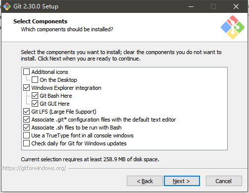
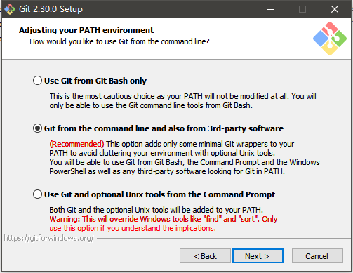
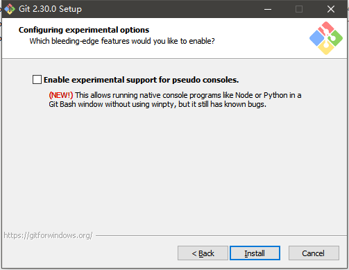
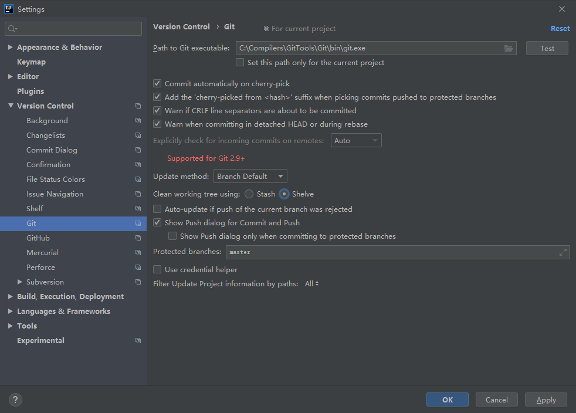
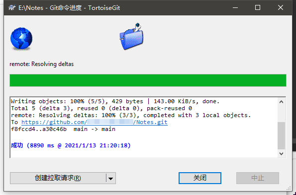

# Git和TortoiseGit的安装配置
---
>**说明**：本文档仅作为自己的学习记录，其大部分内容源自CSDN博主IT_CREATE，但新增修改了一些内容；若对文档内容有疑问之处，请[阅读原文](https://blog.csdn.net/it_create/article/details/106169008)；此外，如果想了解更多Git操作，请参考[廖雪峰Git教程](https://www.liaoxuefeng.com/wiki/896043488029600)。
## Git的安装与配置
### 1 Git下载安装
#### 1.1 下载Git
- 由于Git官网下载很慢，所以建议使用迅雷下载(不知道为什么迅雷现在很快)；
- [点击](https://git-scm.com/)进入Git官网获取不同版本的Git下载链接；
- Git版本分为`安装版`和`便携版`(即绿色免安装版)，本文档以Windows环境下安装版为例进行说明；
#### 1.2 安装Git
- 开始安装，一路`next`到选择要安装的路径这一步，选择自定义路径安装；
    >**说明**：此处建议路径中最好不含空格和中文字符，虽然不是不可以，但是最好养成这个习惯，毕竟有些环境如果安装路径包含空格和中文字符在使用过程中可能会遇到未知错误。
    
- 选择安装组件，这一步个人觉得默认就好；
  - 第一个复选框`Additional icons`这部分事再桌面创建图标，但是一般很少去桌面特意点击图标，所以其实没必要勾选；
  - 最后两个复选框分别是`控制台窗口的字体设置`和`检查更新`，这个没必要勾选；
    
- 默认，`next`；
    
- 选择Git默认使用的文本编辑器；
  - 这一步主要是为Git选择做一些配置时候所使用的默认的文本编辑器，一般很少用到，因为我们使用Git主要使用TortoiseGit的可视化界面进行；
  - 如果选择默认的Vim为默认的文本编辑器，那么请记住一些基本操作(Vim为Unix和类Unix系统的文版编辑器，比较极客，但是功能也强大)；
    - Git Bash控制台中使用`vi`指令进入Vim编辑器；
    - 按`a、i、o`其中的的一个进入编辑状态；
    - 按`ESC`退出编辑状态；
    - 在编辑模式下，`:wq`为保存并退出，`:q!`不保存退出；
    
    
- 下一步，进入分支名称设定界面；
  - 默认是选择的`New!`这个选项，既然是New，那就选择体验一下；
    
    
- 下一步，进入调整Path环境变量界面；
  - **选择一**：这个选择是“仅从Git Bash”使用Git。最安全的选择，选择这个选项，Path环境变量不会被修改；
  - **选择二**：这个选择是“从命令行以及第三方软件使用Git”。该选择是默认的推荐选项，选择这个选项可以在环境变量添加一句索引，从而可以在普通的命令提示符窗口或者一些第三方然软件中使用Git；
  - **选择三**：这个选择是“从命令提示符使用Git和可选的Unix工具”。这个选择含有警告，警告内容为：这将覆盖如”find”和“sort”的Windows工具，只有在了解其含义后才使用此选项，不建议不了解的初学者选择此选项；
 
- 下一步，进入选择HTTP后端传输方式界面；
  - **选项一**：使用OpenSSL库。此选项是默认选项，也是我们常用的选项。
  - **选项二**：使用本地Window安全通道库。服务器证书将使用Windows证书存储验证，此选项还允许您使用公司的内部根CA证书；此选项个人建议还是理解这个选择意思的情况下再考虑是否选择，否则选择默认第一个选择就好了；

- 下一步，进入配置行尾换行符的转换方式；
    >**说明**：本设置的意义是选择对待行结束换行符处理方式的选项，有时候在使用Git的情况下后有没有修改的文件要提交，可能是换行符的问题，初学的话默认就好。
    - 不同系统中的换行符不一样，内容参考请[点击](https://www.cnblogs.com/merray/p/6288611.html)；
      - UNIX/Linux中的换行符：0x0A(LF);
      - Mac OS中的换行符：0x0D(CR)，后来的OS X在更换内核后与UNIX保持一致了；
      - DOX/Windows的换行符：0x0D0A(CRLF);
    
- 下一步，进入配置终端模拟器以与Git Bash一起使用的界面；
  - **选项一**：使用MinTTY(MSYS2的默认终端)。Git Bash将使用MinTTY作为终端模拟器，该模拟器具有可调整大小的窗口，非矩形选择和Unicode字体。Windows控制台程序(例如交互式Python)必须通过“winpty”启动才能在MinTTY中运行；此选项为默认选择；
  - **选项二**：使用Windows的默认控制台窗口。Git将使用Windows的默认控制台窗口(“cmd.exe”)，该窗口可以与Win32控制台程序(如交互式Python或node.js)一起使用，但默认的回滚非常有限，需要配置为使用unicode字体以正确显示非ASCII字符，并且在Windows 10之前，其窗口不能自由调整大小，并且只允许矩形文本选择；

- 下一步，进入选择git pull的默认行为；
>**说明**：fast-forward是指当前分支合并到另一分支时，如果没有分歧解决，就会直接移动文件指针；rebase有种说法是重建时间线，具体含义请见[廖雪峰Git教程](https://www.liaoxuefeng.com/wiki/896043488029600/1216289527823648)。
  - **选择一**：Default(fast-forward or merge)。git pull的标准行为：如果可能将当前分支快进到获取的分支，否则创建合并提交；初学默认选择这个；
  - **选择二**：Rebase(变基，也不知道这中文名词有啥含义)。将当前分支重新放置到获取的分支上。如果没有本地提交要变基，则相当于fast-forward；
  - **选择三**：Only ever fast-forward；fast-forward到抓取的分支，如果不可能则失败；

- 下一步，选择一个凭据帮助方式，又标了`New!`，还是默认选项，那就这个了；

- 下一步，进入额外的配置选项，这个设置虽然有`New!`但是说存在已知bug，默认也没勾选，所以就先不勾选了；

### 2 Git配置
#### 2.1 启动Git Bash
- Windowsk开始菜单打开Git Bash，启动git命令行工具；
#### 2.2 配置用户名和邮箱
- 在命令行分别依次输入下面两个命令，配置自己的用户名和邮箱，这个是用来表明身份的，最好是和自己的github或者码云这些一致，不一致也没关系，主要是提交代码这些表明自己身份信息用的；
  
      git config --global user.name "xxx"  # 这里xxx输入自己的用户名
      git config --global user.email "xxx"  # 这里xxx输入自己的电子箱
  

#### 2.3 生成公钥和私钥
- 生产的公钥和私钥一般放在用户目录的.ssh目录下；
  
      cd ~/.ssh # 进入.ssh目录
      ls  # 查看目录下的内容

- 在命令行输入下面两个命令，分别生成适用于gitee和github的公钥和私钥，成的公钥和私钥默认在用户目录下.ssh目录下,邮箱就是刚才配置的邮箱；
  
      ssh-keygen -t rsa -C "xxxxxxx@xx.com" -f "github_rsa"  # 生成github用的私钥公钥
      ssh-keygen -t rsa -C "xxxxxxx@xx.com" -f "gitee_rsa"  # 生码云用的私钥公钥

#### 2.4 拷贝公钥
- **方式一**：直接进入`c:\user\xxx\.shh`目录，使用Notepad++编译器打开github_rsa.pub或者gitee_rsa.pub的两个文件进行复制；
- **Git Bash中使用Clip复制**
  
      clip < github_rsa.pub # clip可以将pub文件中的内容复制到剪贴板

#### 2.5 添加配置
- 使用`vi config`指令进入Vim编辑器模式添加以下内容；
  
      # github
      Host github.com
      HostName github.com
      PreferredAuthentications publickey
      IdentityFile ~/.ssh/github_rsa

      # gitee
      Host gitee.com
      HostName gitee.com
      PreferredAuthentications publickey
      IdentityFile ~/.ssh/gitee_rsa
  
#### 2.6 查看结果
- 使用`ssh -T git@github.com`指令和`ssh -T git@gitee.com`指令查看是否添加配置成功；
- 看到`Hi xxx`则表明配置生效；

#### 2.7 配置过程问题解决方案
- 在配置Git的config的时候如果直接复制网页的配置信息，可能会遇到以下问题；

- 问题原因：由于是复制的网页内容，可能混入了无关字符`\302\240`这种字符；
- 解决方案：重新进入Git配置的默认文本编辑器，手动敲入各个字符；
#### 2.8 GitHub配置公钥
- 登录[GitHub](https://github.com/);
- 点击头像，选择`Settings`；

- 选择`SSH and GPG keys`，点击`New SSH key`进入SSH key添加页面；

#### 2.9 码云配置公钥
- 登录[码云](https://gitee.com/);
- 点击头像，选择`设置`；

- 选择`SSH`公钥，输入公钥标题和公钥，点击确定添加SSH key;

#### 2.10 IDEA配置Git
- 点击`file`，选择`Settings`进入设置界面，按下图所示配置；

- 拉取项目，按下图配置；

## TortoiseGit安装与配置
### 3 TortoiseGit下载安装
#### 3.1 下载TortoiseGit
- 同Git下载，如果下载慢，可以使用迅雷下载；
- [点击](https://tortoisegit.org/)进入TortoiseGit官网下载合适版本的TortiseGit和对应的汉化包；
#### 3.2 安装TortoiseGit
- 先安装TortoiseGit，之后再安装汉化包；
- 选择SSH客户端，默认选择，下一步；

- 选择安装路径，自定义选择后下一步；

- 配置git.exe，这一步如果之前安装好git，配置好path变量，则会自动索引出来，否则去找安装git的路径下照git.exe

- 配置用户信息，如果Git安装后配置好用户名和邮箱，此处也会自动索引；

- 最后一步默认，点击完成；

- 安装汉化包；
#### 3.3 过程问题解决方案
- TortoiseGit安装好后，右键会有一些选项，但是初次安装好点击可能会遇到`tortoisegitpdc launch failed`错误；
- 解决方法：重启电脑就能解决；
### 4 TortoiseGit配置
#### 4.1 生成公钥私钥
- 开始菜单选择TortoiseGit目录下的`PuTTYgen`;
- 点击`PuTTY Key Generator`窗口的`Generate`，之后在进度条上滑动鼠标生成公钥并按需设定私钥密码；

- 点击`Save public key`和`Save private key`分别保存公钥和私钥，私钥是ppk文件；
#### 4.2 Github和码云配置公钥
- 同Git公钥配置步骤；
#### 4.3 拉取项目和提交项目
- 拉取项目；
  - 复制GitHub或者码云的项目地址；
  - 在本地磁盘任意位置按住`shift+鼠标右键`点击克隆，不过建议在将远端项目克隆到的位置进行右键，哪有打开的克隆窗口会自动获取当前位置；
  - 在克隆页面URL栏填入复制的远端项目地址，选择要保存的本地路径；
  - 勾选`加载Putty密钥`并选择对应平台的私钥文件；
  
- 提交项目；
  - 由于git项目提交时3段式的，中间有个暂存器，所以如果提交修改的项目，需要先commit，然后再push，不过如果实际进行项目开发，一般的习惯是先pull，再commit，最后push;
  
  
  
### 5 实现GitHub和码云的同时推送
#### 5.1 在GitHub和码云建立同样的仓库
- 先在GitHub建立空的仓库，复制长裤链接；
- 在码云新建仓库，在新建仓库页面最低端选择导入现有仓库，复制github的项目地址，建立仓库；
#### 5.2 同时推送项目修改内容到两个仓库相关配置
- 使用PuTTYgen按上述步骤生成一个公钥私钥(上述针对两个平台各自配置的SSH key用来进行分平台同步，这次生产的同一个SSH key，用来进行两个平台的同时推送和同步)；
- 将生成的公钥同时配置到GitHub和码云；
- 在克隆项目的文件夹显示隐藏文件，会看到一个.git文件夹，使用记事本打开文件夹中的config文件，按如下进行配置；

      [core]
      	repositoryformatversion = 0
      	filemode = false
      	bare = false
      	logallrefupdates = true
      	symlinks = false
      	ignorecase = true
      [fetch]
      	prune = false
      [remote "{自定义一个名称}"]
      	url = git@github.com:{个人空间地址名称}/{项目名称}.git
      	url = git@gitee.com:{个人空间地址名称}/{项目名称}.git
      	fetch = +refs/heads/*:refs/remotes/GitHub/*
      	puttykeyfile = C:\\Users\\xxx\\.ssh\\github_gitee_private_tortoisegitppk
      [branch "main"]
      	remote = main
      	merge = refs/heads/main

#### 5.3 同时推送项目修改内容到两个仓库
- 在项目文件夹右键点击`Git 同步`；

- 分别点击提交和推送即可将内容同时推送到GitHub和码云；