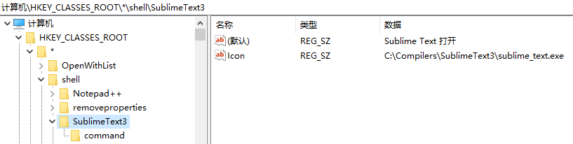
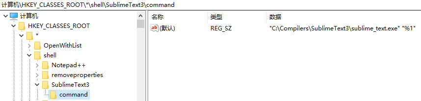
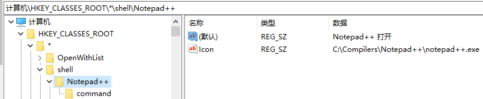
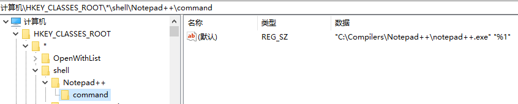

# 文本编辑器的安装与配置
---
>注意：以下内容中涉及到的所有相关文件路径以读者自己实际的安装路径为准，此处仅为示例。
## 1 VSCode安装与配置
### 1.1 说明
- `VSCode`是微软提供的一个免费开源现代化轻量级跨平台编辑器；
- 由于依托微软，所以具有强大优势；
- 虽然它很强大，但是随着一次又一次更新，插件的增多，也有了启动慢等特点；
- 虽然目前它还有不少缺点，但是就笔者当前的使用来看，用的是最舒服的；
### 1.2 安装与配置
#### 1.2.1 下载安装
  - 官网下载地址：[点击下载](https://code.visualstudio.com/)；
  - VSCode在Windows上只有安装版，不过毕竟是微软自家的产品，倒也无需担心；
#### 1.2.2 基本配置
- 插件安装：`Ctrl+Shift+X`然后输入想要的插件名称检索进行安装；
- 汉化；VSCode目前直接安装后是英文界面，需要安装汉化插件`Chinese (Simplified) Language Pack for Visual Studio Code`；
- 界面字体显示设置：`Ctrl+,`进入可视化设置界面，即可进行相关的显示设置；
#### 1.2.3 Markdowm环境配置
- 安装插件`Markdown All In One`，该插件提供快捷键、目录和自动预览等功能(不过自动预览很丑)；
- 安装数学公式插件`Markdowm+Math`，该插件提供自动Katex语法索引，补充All In One的不足；
- 安装插件`Markdown Shortcuts`，安装该插件后会在右键快捷方式中多一堆快捷操作，补充All In One的不足；
- 安装插件`Open In Typora`，该插件预览Markdown效果更好，并且可以以不同主题导出pdf，且比较美观，只不过需要安装额外的Typora软件；
- (可选)安装`Marodown Preview Enhanced`插件，可以预览Markdown，并且含有多种主题，也可导出html和pdf；
  - 配置`Prince`，以导出pdf (其实导出的PDF很糟糕，所以可选可不选，个人建议还是不用配置了，配置Typora更香)；
  - `Prince`官网下载地址：[点击下载](https://www.princexml.com/download)；
  - 绿色版zip下载直接解压，配置bin目录到Path的环境变量即可；
#### 1.2.4 Typora配置
- 安装插件`Open In Typora`后，右键快捷菜单会多一个`Open In Typora`的选项，不过该选项要生效，需要添加Typora安装目录到Path环境变量；
- Typora软件下载地址：[点击下载](https://www.typora.io/)；
- Typora主题下载地址1，官网下载地址，下载很慢，[点击下载](https://theme.typora.io/)；
- Typora主题下载地址2，下载快，但是只有部分在Media中，[点击下载](https://github.com/typora/typora-theme-gallery)；
- Typera主题配置(笔者预览通常选择Mo-Dark，导出PDF选择Mo)；
```css
/* 
 * 添加主题路径：C:\Users\XXX\AppData\Roaming\Typora\themes
 * 设置全局字体属性
 * 在该路径下新建名为base.user.css的文件，并添加以下内容
 */
html,body {
    font-family: JetBrains Mono NL, Noto Sans S Chinese Regular;
    font-size: 15px;
}

code {
    font-family: JetBrains Mono NL, Noto Sans S Chinese Regular;
    font-size: 13px;
}

#write .CodeMirror-wrap .CodeMirror-code pre {
    font-family: JetBrains Mono NL, Noto Sans S Chinese Regular;
    font-size: 13px;
}
```
- **说明1**：在编写Markdown文件是，如果插入图片，记得在图片前空一行，这样Typora预览的图片才会居中；
- **说明2**：在Markdown文件中插入LaTex公式时，如果是块间公式，要按以下方式编写；
```text
$$
[LaTex公式]
$$
```
#### 1.2.5 Markdown Preview Enhanced预览配置(可选，不配置也OK，毕竟Typora预览更好)
- style.less
```css
/* 
 * Ctrl+Shift+P输入Customize Css，选择Markdown Preview Enhanced: Customize Css
 * 用以下内容替换原本内容
 * 其中涉及字体的设置按自己喜好进行替换
 */
 
/* Please visit the URL below for more information: */
/* https://shd101wyy.github.io/markdown-preview-enhanced/#/customize-css */
.markdown-preview.markdown-preview {
  // modify your style here
  // eg: background-color: blue;
  // Preview Font Setting
  font-family: "JetBrains Mono NL", "Noto Sans S Chinese Regular"; // Preview Improper
  //color: black;
  letter-spacing: 0.015in; 
  //line-height: 0.4in;
  //font-size: 1em;

/* 以下是图片显示自定义设置 */
.markdown-img-description{
  text-align: center;
  margin-top: -1em;
  color: #666;;
  margin-bottom: 0.5em;

html body img{
  border:2px solid #ccc;

.markdown-p-center{
  text-align: center;
}
/* 图片自定义设置结束 
/* 代码块字体设置 */
.markdown-preview code,.markdown-preview pre
{  
   font-family: "JetBrains Mono NL", "Noto Sans S Chinese Regular";

/* 代码块字体备用设置
.markdown-preview pre
{
  font-family: "JetBrains Mono NL", "Noto Sans S Chinese Regular";

.markdown-preview pre>code
{
  font-family: "JetBrains Mono NL", "Noto Sans S Chinese Regular";

.markdown-preview pre[class*="language"]
{
  font-family: "JetBrains Mono NL", "Noto Sans S Chinese Regular";
}
*/
/* 代码块字体设置结束 */
```
- parser.js
```js
// 默认设置
/*
module.exports = {
  onWillParseMarkdown: function(markdown) {
    return new Promise((resolve, reject)=> {
      return resolve(markdown)
    })
  },
  onDidParseMarkdown: function(html) {
    return new Promise((resolve, reject)=> {
      return resolve(html)
    })
  }
}
*/

/* 
 * Ctrl+Shift+P，输入Extend Parser，选择Markdown Preview Enhanced: Extend Parser
 * 注释掉默认设置并添加以下代码
 * 图片自定义设置
 * 脚本用法如下：
 * 英文半角感叹号[图片注释|图片标题|图片大小](图片地址)
 */
const scripts = `
<script>
    function setCurrent(){
        const links = document.querySelectorAll(".md-sidebar-toc a")
        for(const link of links){
            link.style.color="";
        }
        const hash = location.hash;
        const a = document.querySelector('a[href="'+hash+'"]');
        if(a){
            a.style.color = "#f40";
        }
    }
    setCurrent();
    window.onhashchange = setCurrent;
</script>
`;
var fs = require("fs");
module.exports = {
  onWillParseMarkdown: function(markdown) {
    return new Promise((resolve, reject) => {
      const reg = /\!\[(.*)\]\((\S+)\)/gm;
      markdown = markdown.replace(reg, function(match, g1, g2) {
        var width = "100%";
        if (g1) {
          var w = g1.split("|");
          if (w.length > 2) {
            width = w[2] + "px";
            g1 = w[1];
          } else if (w.length > 1){
            g1 = w[1];
          } else {
            g1 = "";
          }      
        }
        return `
        <p class="markdown-p-center">
            
        </p>
        <p class="markdown-img-description">
          ${g1}
        </p>
        `;
      });
      resolve(markdown);
    });
  },
  onDidParseMarkdown: function(html) {
    return new Promise((resolve, reject) => {
      return resolve(scripts + html);
    });
  }
};
/* 图片自定义设置结束 */
```
- `Ctrl+,`打开设置，扩展中对该差距的显示主题和代码块主题进行选择，笔者通常选择的是`Monokai`；
#### 1.2.6 LeetCode刷题环境配置
- 安装插件`LeetCode`，该插件可以使用VSCode刷LeetCode，安装后侧边栏便会多一个LeetCode图标；
- 安装插件后还需要进行NodeJS配置，否则插件无法正常运行，NodeJS安装见笔者GitHub的NodeJS配置，[点击查看](https://github.com/free-stardust/Notes/blob/main/CSNotes/EnvironmentDeploy/NodeJSDeploy.md)；
- NodeJS安装完毕后需要对插件进行设置；
  - `Ctrl+,`打开设置，扩展中选择LeetCode，设置`Node Path`为此类形式`C:\Enviornments\NodeJS\NodeFile\node.exe`(实际以自己安装路径为准)；
  - 设置`Endpoint`为`leetcode-cn`，这东西不设置的话默认是US的；
  - 设置`Show Description`，这个是在刷题的时候，设置题目内容现在的方式，笔者一般选择`In File Comment`，这样可以顺便保存题目，当然，读者视自己喜好选择；
  - 设置`Work Space Folder`，这个就是题解本地存档路径；
  - 以上设置完毕，点击侧边栏LeetCode图标，点击那个小地球图标，进行登录，稍等一下，便可开始刷题；
- VSCode刷题的好处就是每道题目都可以显示通过率，而且还会显示哪个公司的题目；
- 写完题解后，最下面有个`Submit | Test`便是对应web端的提交和执行测试；
- 自此，LeetCode刷题环境配置完毕，另外为了高校刷题，也可以配合某大厂大佬的刷题笔记进行刷题，笔记地址：[LeetCode Cookbook](https://books.halfrost.com/leetcode/)；
- **小建议**：笔者建议可以刷题的工作路径，可以设置为一个固定的GitHub项目文件夹，这样还能远端备份自己的题解，顺便进行GitHub打卡，一举两得；
#### 1.2.7 C/C++编译环境配置
>**说明**：此处的配置有官方文档，只不过是全英文的，详情[参见官方配置文档](https://code.visualstudio.com/docs/cpp/config-mingw)。
- **配置前注意**：由于VSCode只是一个编辑器，如果是编写的单个C/C++文件进行运行是可以的，但是如果多个文件进行link，则很不方便，需要自己写Makefile，嫌麻烦的话还不如用专门的C/C++开发工具，所以配置者环境仅限于独立文件练习或者文件编辑；
- 安装插件`C/C++`；
- 配置`mingw64`环境；
  - 下载`mingw64`，下载地址[https://sourceforge.net/projects/mingw-w64/files/](https://sourceforge.net/projects/mingw-w64/files/)；
  - 进入下载地址**不要**点击`Download Lasted Version`下载，下滑，找到最新版，下载`x86_64-posix-seh`；
  - 下载之后是一个7z压缩包，另外，该网站有时候下载很慢；
  - 选择一个合适的位置解压，由于是绿色版，解压后配置环境变量即可使用，笔者的解压目录是`C:\Enviornments\mingw64\`；
  - 将该目录`C:\Enviornments\mingw64\bin`配置到环境变量即可；
  - 配置成功后，`Win+R`打开控制台窗口输入`gcc`，如果出现以下内容，说明配置成功；
    ```shell
    Microsoft Windows [版本 xx.x.xxxxx.xxx]
    (c) 2020 Microsoft Corporation. 保留所有权利。

    C:\Users\xxx>gcc
    gcc: fatal error: no input files
    compilation terminated.

    C:\Users\xxx>
    ```
- VSCode配置
  - 按自己喜好新近一个空文件夹，作为C/C++项目目录，笔者新建的文件夹为`D:\Projects\VSCcodeProjects\`；
  - 在当前目录新建文件夹`CProjects`，并在该文件夹中新建`helloworld.c`或者`helloworld.cpp`文件，添加测试内容；
    ```c
    #include <stdio.h>
    #include <windows.h>

    int main() {
        printf("Hello World!\n");
        system("pause");
        return 0;
    }
    ```
  - 点击侧边栏那个🐞图标，进入调试模式，在弹出的控制台窗口选择`C++(GDB/LLDB)`，之后再选择g++.exe，就会在`D:\Projects\VSCcodeProjects\`目录下生成`launch.json`配置文件，按如下内容修改相关配置；
		```json
		{
    	"version": "0.2.0",
    	"configurations": [
    	 	 {
    	      	"name": "(gdb) build",
    	      	"type": "cppdbg",
    	      	"request": "launch",
    	      	"program": "${fileDirname}\\${fileBasenameNoExtension}.exe", // 修改默认值
    	      	"args": [],
    	      	"stopAtEntry": false,
    	      	"cwd": "${workspaceFolder}",
    	      	"environment": [],
    	      	"externalConsole": true, // 修改默认的"console": "externalTerminal"
    	      	"MIMode": "gdb",
    	      	"miDebuggerPath": "C:\\Enviornments\\mingw64\\bin\\gdb.exe", // 按实际安装位置修改
    	      	"setupCommands": [
    	          	{
    	              	"description": "为 gdb 启用整齐打印",
    	              	"text": "-enable-pretty-printing",
    	              	"ignoreFailures": true
    	          	}
    	      	],
    	      	"preLaunchTask": "g++" // 这里默认没有，需要添加，名称自己定义就好
    	  	}
    	]
		}
		```
	- 返回`helloworld.c`或者`hellow.cpp`文件，点击F5进行调试，这时会弹出窗口提示找不到任务`g++`，选择**配置任务**，然后弹出的小窗口候选选择`C/C++: cl.exe 生成活动文件`，便会自动生成`task.json`文件，之后按如下内容进行修改；
		```json
		{
			"version": "2.0.0",
			"tasks": [
				{
					"type": "cppbuild",
					"label": "g++", // 名称和launch.json文件中的"preLaunchTask":"g++"名称一致
					"command": "C:\\Enviornments\\mingw64\\bin\\g++.exe", // 按实际安装情况修改
					"args": [
						"-g",	// 修改默认值为-g，此为g++编译命令
            "${file}",
						"-o",	// 修改默认值为-o，此为g++编译命令
						"${fileDirname}\\${fileBasenameNoExtension}.exe",
            "-m64",  // 不知为何有时会生成16位程序而无法运行，此条可强制生成64位的
            "-Wall", // 开启额外警告
            "-static-libgcc",     // 静态链接libgcc，一般都会加上
            "-fexec-charset=GBK", // 生成的程序使用GBK编码，不加会导致Win下输出中文乱码；繁体改成BIG5
            "-D__USE_MINGW_ANSI_STDIO", // 用MinGW写C时留着，否则不需要，用于支持printf的%zd和%Lf等
					],
					"options": {
						"cwd": "C:\\Enviornments\\mingw64\\bin" // 按实际安装情况修改
					},
					"problemMatcher": [
						"$msCompile"
					],
					"group": "build",
					"detail": "Complier: g++.exe"
				}
			]
		}
		```
	- 自此，VSCode的C/C++编译环境配置完毕，另外如果想了解g++编译命令，请参考博主`步孤天`的文章：[g++编译总结](https://www.cnblogs.com/bugutian/p/4490902.html)；
## 2 Sublime Text安装与配置
### 2.1 安装与破解
#### 2.1.1 安装版与绿色版
- 直接安装便可配置鼠标右键菜单，且会写入注册表数据；
- 解压即用，需要自己配置右键快捷菜单；
#### 2.1.2 破解激活
- 破解与激活
  - 修改hosts文件，添加以下内容屏蔽激活验证；
```text
127.0.0.1 sublimetext.com
127.0.0.1 sublimehq.com
127.0.0.1 license.sublimehq.com
127.0.0.1 45.55.255.55
127.0.0.1 45.55.41.223
0.0.0.0 license.sublimehq.com
0.0.0.0 45.55.255.55
0.0.0.0 45.55.41.22
```
- 输入激活许可激活;
>注：此处许可适用Sublime Text3 Build3211。
```text
----- BEGIN LICENSE -----
Member J2TeaM
Single User License
EA7E-1011316
D7DA350E 1B8B0760 972F8B60 F3E64036
B9B4E234 F356F38F 0AD1E3B7 0E9C5FAD
FA0A2ABE 25F65BD8 D51458E5 3923CE80
87428428 79079A01 AA69F319 A1AF29A4
A684C2DC 0B1583D4 19CBD290 217618CD
5653E0A0 BACE3948 BB2EE45E 422D2C87
DD9AF44B 99C49590 D2DBDEE1 75860FD2
8C8BB2AD B2ECE5A4 EFC08AF2 25A9B864
------ END LICENSE ------
```
- 做完以上工作，如果防止其自动更新，可以关闭自动检查，在`preferences->Setting-User`设置文件中添加以下内容；
```json
"update_check": false,
```
### 2.2 配置
#### 2.2.1 安装Package Control;
- 国内未知原因在线安装Packacge Control会失败，所以采取离线安装方式，下载地址为[GitHub下载](https://github.com/wbond/package_control)；
- 进入GitHub的package_control项目后，直接下载整个项目的zip；
- 下载的项目解压直接重命名放在Sublime Text3的根目录中`Data/Packages`目录下即可；
- 上述操作过后Package Control可能依旧无法使用，原因是获取包安装清单文件channel_v3.json失败；
- 如果网好的时候，可以直接从原地址下载该json文件，[源地址下载](https://packagecontrol.io/channel_v3.json)；
- 笔者GitHub中也备份了channel_v3.json(源地址下载时间为2021/02/23)，[点击下载](https://github.com/free-stardust/Notes/blob/main/CSNotes/EnvironmentDeploy/assets/channel_v3.json)；
- 下载后将该文件放到Sublime Text3根目录的Packages文件夹中，毕竟是包清单，放在这里比较合理；
- 修改`Package Control`用户设置，`Preference->package setting->package control->setting`；
- 在`Package Control.subime-setting--User`文件中添加以下内容；
```json
"channels":
[
  "C:/Apps/TextEditors/SublimeText3/Packages/channel_v3.json",
]
```
- 自此，Package Control即可正常使用；
#### 2.2.2 汉化
- `Ctrl+Shift+P`打开命令窗口，输入`Install Package`；
- 候选中会看到`Package Control: Install Package`选项，点击后则会跳出包安装窗口；
- 在包安装窗口输入`localizeMenu`，安装该插件；
- 安装`localizedMenu`后，选择`Preference->show language->中文`，即可显示中文界面；
#### 2.2.3 侧边栏颜色同步
- 安装`SyncedSidebarBg`，使侧边栏与编辑区主题配色一致；
- 注意，安装侧边栏背景同步插件后，当前侧边栏的配色不会同步默认的Monokai配色；
- 若要同步配色可以切换下主题，或者`Ctrl+Shift+P`安装`Monokai Gray`和`Monokai Dark`主题，当然其他主题也可，笔者比较喜欢这个系列的主题；
#### 2.2.3 禁用、启用和移除插件
- 禁用插件`Ctrl+Shift+P`，输入`Disable Package`，选择`Package Control: Disable Package`，弹出窗口选择要禁用的即可；
- 启用插件`Ctrl+Shift+P`，输入`Enable Package`，选择`Package Control: Enable Package`，弹出窗口选择要启用的即可；
- 移除插件`Ctrl+Shift+P`，输入`Remove Package`，选择`Package Control: Remove Packsge`，弹出窗口选择要移除的即可；
#### 2.2.3 安装SideBarEnhancements插件
- 该插件增强了侧边栏功能；
- `Ctrl+Shift+P`输入`install package`，选择`Package Control: Install Package`，弹出窗口输入插件名称点击即可安装；
- 安装后配置，该配置适合web开发做各种浏览器调试，从而增加了不同浏览器打开的快捷键；
- 配置文件`Preference->Package Setting->Side Bar->Key Binding-User`；
- 打开后在`Default(Windows).sublime-keymap`文件中添加以下内容；
```json
[
  { "keys": ["ctrl+shift+c"], "command": "copy_path" }
  // edge
  { "keys": ["f1"], "command": "side_bar_files_open_with",
      "args": {
          "paths": [],
          "application": "C:/Program Files (x86)/Microsoft/Edge/Application/msedge.exe",
          "extensions":".*", // 匹配任何文件类型
      }
  }
  // chrome
  { "keys": ["f2"], "command": "side_bar_files_open_with",
      "args": {
          "paths": [],
          "application": "C:/Program Files (x86)/Google/Chrome/Application/chrome.exe",
          "extensions":".*"
      }
  }
  // firefox
  { "keys": ["f3"], "command": "side_bar_files_open_with",
      "args": {
          "paths": [],
          "application": "C:/Program Files/Mozilla Firefox/firefox.exe",
          "extensions":".*"
      }
   }
  // ie
  { "keys": ["f4"], "command": "side_bar_files_open_with",
      "args": {
          "paths": [],
          "application": "C:/Program Files/Internet Explorer/iexplore.exe",
          "extensions":".*"
      }
  }
]
```
#### 2.2.4 其他配置
- 同以上步骤安装`ConvertToUTF8`插件，解决中文乱码的问题；
- 同以上步骤安装`BracketHighlighter`，使括号、引号、html标签等高亮显示；
#### 2.2.5 使用注意事项
- 对于初次启动的Sublime，字体显示和大小可能不好看而且小，所以可以进行如下设置；
- 按此路径`Preference->Setting-User`打开的设置文件,添加以下内容；
```json
"font_face": "JetBrains Mono NL",
"font_size": 12,
```
- 对于Mac，笔者看到网上有人说，由于文件索引会经常卡死，并提供了解决方法，笔者也将其解决方案记录了过来；
- 同样是在`Preference->Setting-User`打开的设置文件中添加以下内容；
```json
"index_file": false,
```
- 在写代码的过程中，有时候由于分栏，或者现实问题，一行内容如果显示不下会自动换行，如果不希望自动换行，可以进行如下设置；
- 同样是在`Preference->Setting-User`打开的设置文件中添加以下内容；
```json
"word_wrap": false,
```
- 默认情况下Sublime的vim模式是启用状态，如果一不小心按了esc就会是文件进入Command Mode，无法进行正常编辑；
- 这种情况下有两种处理方式；
  - 第一种处理方式：点击A键或者I键或者O键即可推出Command Mode模式；
  - 第二种处理方式：关闭vim模式，禁用Vintage插件；
- 第二种方式需要在`Preference->Setting-User`打开的设置文件中添加以下内容；
```json
"ignored_packages":
[
    "Vintage",
]
```
#### 2.2.6 右键菜单配置
  - `Win+R`输入`regedit`打开注册表；
  - 定位到`HKEY_CLASSES_ROOT->*->shell`路径下；
  - 新建`SublimeText3`项，并修改`(默认)`字符串值为`Sublime Text 打开`；
  - 在`SublimeText3`项下新建字符串值，重命名为`Icon`，并修改其中的值为`C:/Apps/TextEditors/SublimeText3/sublime_text.exe`；
  - 在`SublimeText3`项下新建`command`项，并修改`(默认)`字符串值为`"C:/Apps/TextEditors/SublimeText3/sublime_text.exe" "%1"`；
  - 自此，右键快捷菜单便会出现相关的快捷方式；
#### 2.2.7 右键菜单配置示例图
- SublimeText3项下的配置



- command项下的配置



## 3 Notepad++安装与配置
### 3.1 安装与配置
#### 3.1.1 安装版和绿色版
- 如果嫌配置麻烦，可以使用安装版本傻瓜式安装，一键配置；
- 如果喜欢绿色版，选择改版，这个版本的安装包，解压即用，但是不会往注册表写入内容，所以右键也没有快捷方式；
#### 3.1.2 针对绿色版的右键打开方式配置
- `Win+R`输入`regedit`打开注册表；
- 定位到`HKEY_CLASSES_ROOT->*->shell`路径下；
- 新建`Notepad++`项，并修改`(默认)`字符串值为`Nodepad++ 打开`；
- 在`Notepad++`项下新建字符串值，重命名为`Icon`，并修改其中的值为`C:/Apps/TextEditors/Notepad++/notepad++.exe`；
- 在`Nodepad++`项下新建`command`项，并修改`(默认)`字符串值为`"C:/Apps/TextEditors/Notepad++/notepad++.exe" "%1"`；
- 自此，右键快捷菜单便会出现相关的快捷方式；
#### 3.1.3 绿色版右键快捷菜单示例图
- Notepad++ 项下的配置



- command项下的配置



### 3.2 题外话
- Nodepad++为免费版文本编辑器，但是界面古老，且作者是个反华分子；
- 虽然该软件的作者有点让人难以接受，但是该软件还是有不少可取之处，比如批量删除空行等操作还是挺方便的；
- 虽然功能强大，但是大部分时候用着还是不如VSCode和Sublime Text舒服，所以当作备用吧；