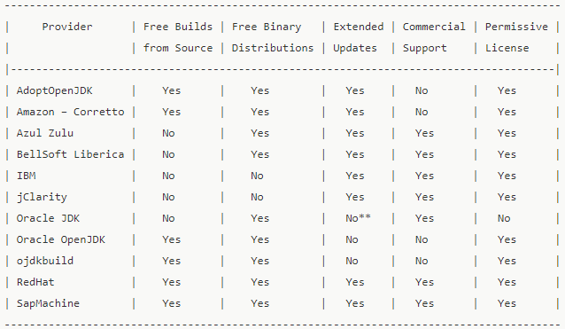

## Java的安装与配置
---
### 1 Java的版本
>注：内容摘取自[OpenJDK和AdoptOpenJDK之间的区别](https://www.aishen360.com/news-1182091.html)。
#### 1.1 OpenJDK的多重含义
- Java平台标准版（Java SE）的免费和开源实现；
- open source repository: Java源代码又名OpenJDK项目；
- 由Oracle维护的预构建的OpenJDK二进制文件；
- AdoptOpenJDK – 社区维护的预建OpenJDK二进制文件(open source licensed)；
#### 1.2 OpenJDK提供商比较
- AdoptOpenJDK – https://adoptopenjdk.net
- 亚马逊 – Corretto – https://aws.amazon.com/corretto
- Azul Zulu – https://www.azul.com/downloads/zulu/
- BellSoft Liberica – https://bell-sw.com/java.html
- IBM – https://www.ibm.com/developerworks/java/jdk
- jClarity – https://www.jclarity.com/adoptopenjdk-support/
- Oracle JDK – https://www.oracle.com/technetwork/java/javase/downloads
- Oracle OpenJDK – http://jdk.java.net
- ojdkbuild – https://github.com/ojdkbuild/ojdkbuild
- RedHat – https://developers.redhat.com/products/openjdk/overview
- SapMachine – https://sap.github.io/SapMachine

#### 1.3 我应该使用哪种Java发行版？
- 在Sun / Oracle时代,通常是Sun / Oracle基于OpenJDK源生成专有的下游JDK发行版.最近,Oracle决定只在附加商业支持的情况下进行自己的专有构建。他们慷慨地在https://jdk.java.net/网站上发布了OpenJDK版本;
- 从JDK 11开始的是从单一供应商(Oracle)思维模式向思维模式的转变，在这种思维模式下，您选择一个提供商，在您喜欢的条件下为您提供产品分发：他们构建的平台，发布的频率/及时性，如何构建支持等等。如果您不信任任何现有供应商，您甚至可以自己构建OpenJDK;
- OpenJDK的每个版本通常都是由相同的原始上游源存储库(OpenJDK“项目”)构成的。然而，每个构建都是非常独特的 – free或商业，品牌或非品牌，纯或捆绑(例如，BellSoft Liberica JDK提供捆绑的JavaFX，已从Oracle构建中删除，从JDK 11开始);
- 如果没有环境(例如，Linux)和/或许可证要求定义特定的分发，并且如果您想要最标准的JDK构建，那么最好的选择可能是使用Oracle的OpenJDK或AdoptOpenJDK；
### 2 Java的安装与环境配置
#### 2.1 Java安装包
- 安装版，傻瓜式安装，安装过程一路下一步，不出意外，环境变量也会自动配置好；
- 绿色版，即压缩包版本，解压即可使用，不过需要自己配置环境变量；
#### 2.2 Java环境变量配置
- JAVA_HOME配置
    ```shell
    # JAVA_HOME
    C:\Enviornments\Java\JDK8
    ```
- CLASSPATH配置
    ```shell
    # CLASSPATH
    # 注意，CLASSPATH配置最前面最好有个点的路径，表示项目的当前目录
    .;%JAVA_HOME%\lib;%JAVA_HOME%\lib\tools.jar;
    ```
- Path中的配置
    ```shell
    # Path —— 非Win10版本环境变量Path配置
    %JAVA_HOME%\bin;%JAVA_HOME%\jre\bin;

    # Path —— Win10版本环境变量Path配置，Win10的Path环境变量需要用绝对路径
    C:\Enviornments\Java\JDK8\bin;C:\Enviornments\Java\JDK8\jre\bin;
    ```